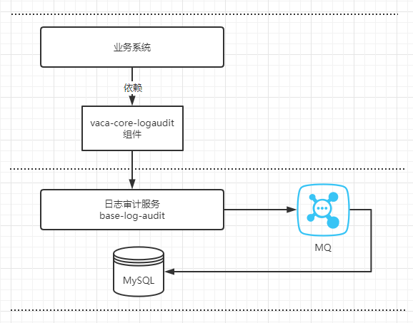

### 系统架构示意图


### 业务系统引入依赖
```xml
<dependency>
    <groupId>fun.werfamily.project</groupId>
    <artifactId>wf-core-logaudit</artifactId>
    <version>3.0.1</version>
</dependency>
```

### 依赖配置
```yaml
wf:
  core:
    logaudit:
      ServiceName: 具体的服务名称或应用名
```

### 使用方式，通过方法注解的方式配置需要上报操作日志的接口
```java
/**
* 注解属性 providerBean 选填默认采用 baseOperatorProvider 操作者解析器
* 默认实现了SAAS AOTH2 获取token用户信息
*/
@WfLogAudit(value = "so-wx.addMember", desc = "门店添加会员")
@Post
public Result addMember(MemberDTO memberDTO) {
   ...
}
```

### 操作者解析器接口（IOperatorProvider）说明
```java
public interface IOperatorProvider {
    /**
     * 解析用户信息
     * @param request 接口请求
     * @param params 接口入参
     * @return
     */
    Operator provider(HttpServletRequest request, Object[] params);

}
```

### 自定义操作者解析器并使用，示例代码如下：
```java
@Component("customOperatorProvider")
public class CustomOperatorProvider implements IOperatorProvider {

    @Override
    public Operator provider(HttpServletRequest request, Object[] params) {
        //实现通过被注解方法请求参数获取操作者信息
        ...
    }
}

//使用注解的时候指定对应的自定义实现
@WfLogAudit(value = "so-wx.addMember", desc = "门店添加会员", providerBean = "customOperatorProvider")
```