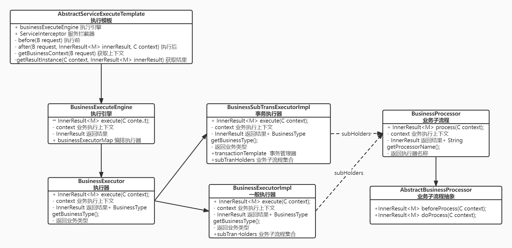

##基础原理
在复杂业务场景中，如校验逻辑、业务逻辑单元一、业务逻辑单元N、后置事件等需要按顺序执行，特别是多租户下的渠道逻辑差异，此时逻辑单元的编排可抽象出来（含事务管理）交由框架执行，提高代码可读性和拓展性。如下为类图示意：

##使用示例
多渠道逻辑可分开配置xml
```java
/**
* 流程编排文件配置
*/
@Configuration
@ImportResource(locations = { "classpath*:order-engine.xml" })
public class OrderEngineConf {
	
}
```
order-engine.xml示意如下

```xml
<?xml version="1.0" encoding="UTF-8" ?>
<!-- 事务执行器配置 多数据源使用-->
<bean id="transactionTemplate"
      class="org.springframework.transaction.support.TransactionTemplate">
    <property name="transactionManager" ref="xxxTransactionManager"/>
</bean>

        <!-- 执行引擎配置-->
<bean id="businessExecuteEngine"
      class="fun.werfamily.starter.process.impl.BusinessExecuteEngineImpl">
<property name="businessExecutorMap">
    <map>
        <!-- 示例为某渠道创建订单, 每个业务流程为一组 -->
        <entry key="ORDER_CREATE"
               value-ref="orderCreateForXX"/>
    </map>
</property>
</bean>

        <!-- 某渠道创建订单主流程-->
<bean id="orderCreateForXX"
      class="fun.werfamily.starter.process.executor.BusinessSubTransExecutorImpl">
<property name="transactionTemplate" ref="transactionTemplate"/>
<property name="subTranHolders">
    <list>
        <!--子流程1-->
        <bean class="fun.werfamily.starter.process.executor.BusinessSubTransExecutorImpl.SubTranHolder">
            <property name="businessProcessors">
                <list>
                    <ref bean="orderCreateXdValidator"/>
                    <ref bean="userLoadAction"/>
                    <ref bean="productLoadAction"/>
                    <ref bean="riskCheckAction"/>
                    ......
                </list>
            </property>
        </bean>
        <!--子流程2受事务控制-->
        <bean class="fun.werfamily.starter.process.executor.BusinessSubTransExecutorImpl.SubTranHolder">
            <property name="businessProcessors">
                <list>
                    <ref bean="orderCommitAction"/>
                    <ref bean="shoppingCartAction"/>
                </list>
            </property>
            <property name="trans" value="true"/>
        </bean>
        <!--子流程3-->
        <bean class="fun.werfamily.starter.process.executor.BusinessSubTransExecutorImpl.SubTranHolder">
            <property name="businessProcessors">
                <list>
                    <ref bean="orderEventPushAction"/>
                </list>
            </property>
        </bean>
    </list>
</property>
</bean>
        </xml>
```
