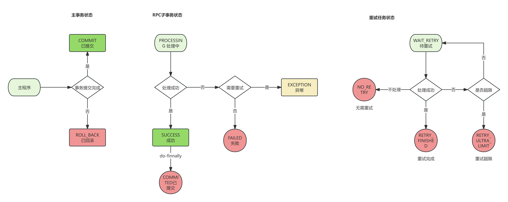

### 设计原理

```text
本框架的设计目标是保障事务的最终一致性(CAP中取CA)， 业界常用的分布式事务解决方案有下述三类：
1.两阶段提交型（暂不支持）
2.异常冲正型
3.努力确保型
本框架支持后两种, 任务在被触发前将被持久化到本地日志表，确保跨服务数据的最终一致性。
```

### 项目配置

新增引入pom配置如下：

```xml
<dependency>
    <groupId>fun.werfamily.project</groupId>
    <artifactId>wf-starter-transaction</artifactId>
    <version>x.y.z</version>
</dependency>
```

确保如下两个定时任务被配置到调度中心

```java
//努力确保型任务异常恢复job
InsurableTaskExceptionRecoverJob
//异常冲正型任务异常恢复job
ReversibleTaskExceptionRecoverJob
```

### 接入方依赖表结构

```sql
CREATE TABLE `transaction_task_log` (
  `id` bigint(20) unsigned NOT NULL AUTO_INCREMENT,
  `task_id` varchar(64) NOT NULL,
  `task_type` varchar(64) DEFAULT NULL,
  `task_class_name` varchar(128) NOT NULL,
  `transaction_type` varchar(32) NOT NULL,
  `status` varchar(32) NOT NULL,
  `retry_status` varchar(32) DEFAULT NULL,
  `reversal_status` varchar(32) DEFAULT NULL,
  `error_code` varchar(64) DEFAULT NULL,
  `error_message` varchar(256) DEFAULT NULL,
  `times` int(10) unsigned DEFAULT NULL,
  `update_time` datetime NOT NULL,
  `create_time` datetime NOT NULL,
  `next_execute_time` datetime DEFAULT NULL,
  `request_additional_info` varchar(4000) DEFAULT NULL,
  `result_additional_info` varchar(4000) DEFAULT NULL,
  PRIMARY KEY (`id`),
  UNIQUE KEY `uk_task_id_type` (`task_id`,`task_type`),
  KEY `idx_update_time` (`update_time`,`transaction_type`),
  KEY `idx_next_execute_time` (`next_execute_time`,`transaction_type`)
) ENGINE=InnoDB DEFAULT CHARSET=utf8mb4;
```

### 代码示例

1.努力确保型任务（如远程事件发布）

```text
努力确保型任务会在主线程提交后触发，如果有事务控制则在事务提交后触发，触发后由本地虚拟机异步线程池调度，任务成功后默认删除日志表。如果异步线程池被强制销毁，则由兜底定时器轮循补偿。
```

```java
public class ServiceA {
    @Autowired
    private InsurableTaskExecutor insurableTaskExecutor;
	
    SyncOrderStatusTask task = new SysnOrderStatusTask();
    task.setOrderInfo(new Object());
    insurableTaskExecutor.execute(task);

    //如下内部类为充血模型设计
    public class SyncOrderStatusTask<T> extends AbstractInsurableTask<T> {
        private OrderInfo orderInfo;

        //业务执行入口
        @Override
        public TaskExecuteResult doExecute() {
            //业务逻辑如果使用bean则通过SpringContextHolder获取（非自动注入）
            return TaskExecuteStatusEnum.SUCCESS;
        }

        //业务核心参数序列化，比如订单号, 用于领域对象句柄持久化
        @Override
        public String serializeAdditionalInfo() {
            return orderInfo.getOrderNo();
        }

        //根据serializeAdditionalInfo存储值重新构建领域对象，用于补偿场景下的对象重建
        @Override
        public void rebuild(TransactionTaskLogDO taskDo) {
            OrderLoadService orderLoadService = SpringContext.getBean(OrderLoadService.class);
            OrderInfo orderInfo = orderLoadService.queryByOrderNo(taskDo.getRequestAdditionalInfo());
            this.orderInfo = orderInfo;
        }
    }
}
```

2.异常冲正型任务 （如库存扣减、券核销等）

```text
异常冲正型任务在提交后交由本地虚拟机异步线程池调度，主事务边界内异步RPC（主线程等待）, 如主线程异常则触发冲正逻辑。异步线程池如果被强制销毁，则由兜底定时器轮循补偿。
```

```java
public class ServiceC {
    @Autowired
    private ReversibleTaskExecutor reversibleTaskExecutor;
    
    //业务逻辑校验
    try {
        //业务逻辑
    } catch(Exception e) {
        reversibleTaskExecutor.setTransactionStatus(TransactionStatusEnum.ROLLBACK);
    } finally {
        reversibleTaskExecutor.doFinally();
    }
}
```

```java
public class ServiceB {
    @Autowired
    private ReversibleTaskExecutor reversibleTaskExecutor;
	
    InventoryCommitTask task = new InventoryCommitTask();
    task.setOrderInfo(new Object());
    reversibleTaskExecutor.execute(task);

    //如下内部类为充血模型设计
    public class InventoryCommitTask<T> extends AbstractReversibleTask<T> {
        private OrderInfo orderInfo;

        //业务执行入口
        @Override
        public T doExecute(){
            //业务逻辑如果使用bean则通过SpringContextHolder获取（非自动注入）
            //如果远程业务受理失败则返回TaskExecuteStatusEnum.EXCEPTION
            InventoryService inventoryService = SpringContext.getBean(InventoryService.class);
            inventoryService.commit(orderInfo);
            return TaskExecuteStatusEnum.SUCCESS;
        }

        //业务核心参数序列化，比如订单号, 用于领域对象句柄持久化
        @Override
        public String serializeAdditionalInfo() {
            return orderInfo.getOrderNo();
        }

        //根据serializeAdditionalInfo存储值重新构建领域对象，用于补偿场景下的对象重建
        @Override
        public void rebuild(TransactionTaskLogDO taskDo) {
            OrderLoadService orderLoadService = SpringContext.getBean(OrderLoadService.class);
            OrderInfo orderInfo = orderLoadService.queryByOrderNo(taskDo.getRequestAdditionalInfo());
            this.orderInfo = orderInfo;
        }

        //业务冲正入口
        @Override
        public T doReversal(){
            //业务逻辑如果使用bean则通过SpringContextHolder获取（非自动注入）
            InventoryService inventoryService = SpringContext.getBean(InventoryService.class);
            inventoryService.cancel(orderInfo);
        }

        //业务冲正判断条件
        @Override
        public TransactionStatusEnum queryBizStatus() {
            OrderLoadService orderLoadService = SpringContext.getBean(OrderLoadService.class);
            OrderInfo orderInfo = orderLoadService.queryByOrderNo(taskDo.getRequestAdditionalInfo());
            if(xxx) {
                //如果订单为有效态 则不需要冲正
                return TransactionStatusEnum.COMMIT;
            } else {
                //如果订单为无效态 则执行冲正
                return TransactionStatusEnum.ROLLBACK;
            }
        }
    }
}
```

